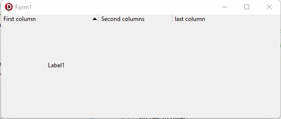

# DelphiTips.SortedHeaderControl
Custom HeaderControl with sorting properties

  Add the Execute.SortedHeaderControl.pas unit in the uses of your form to change THeaderControl behavior

  - SortIndex is the column index where an arrow is displayed
  - negative SortIndex for descending order
  - OnCanSort let you disable a column sorting
  - OnSort is called when SortIndex changes

